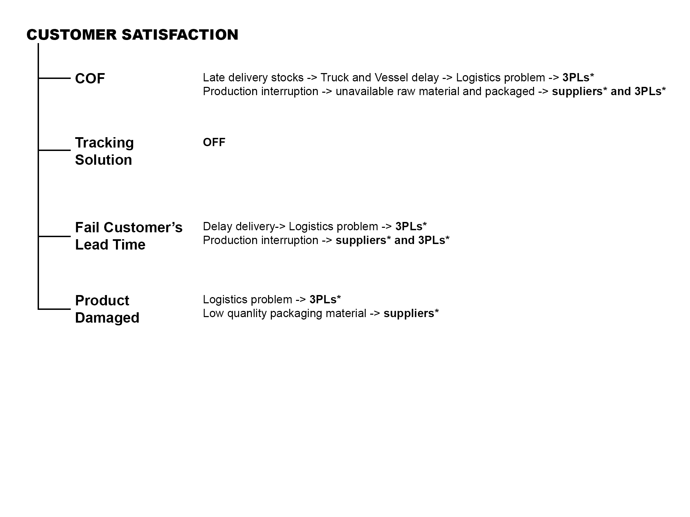
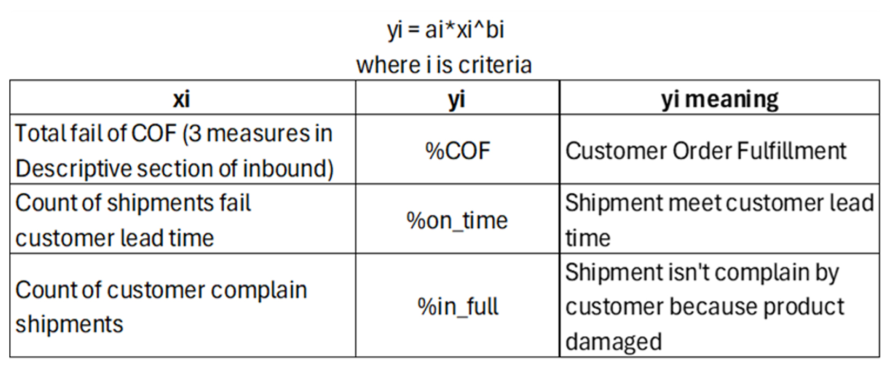
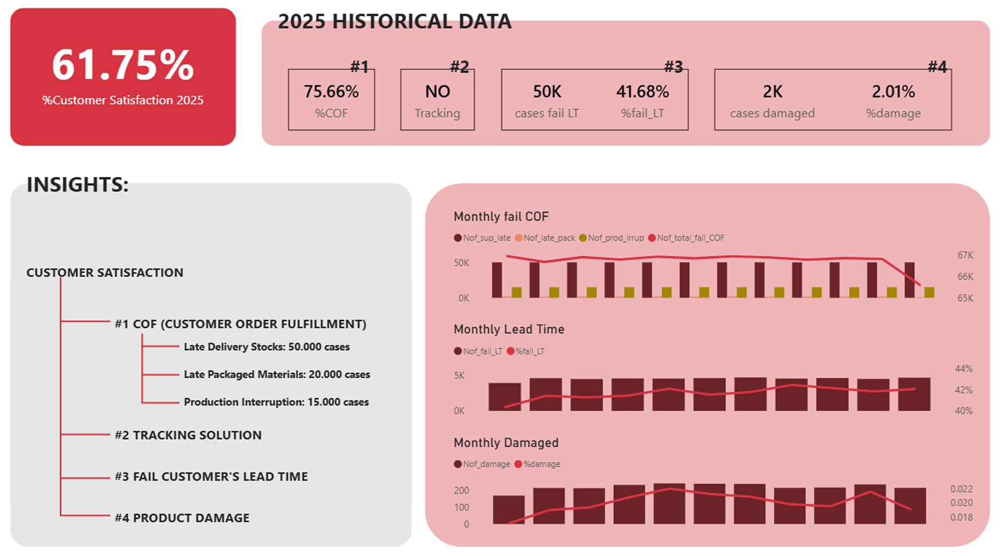
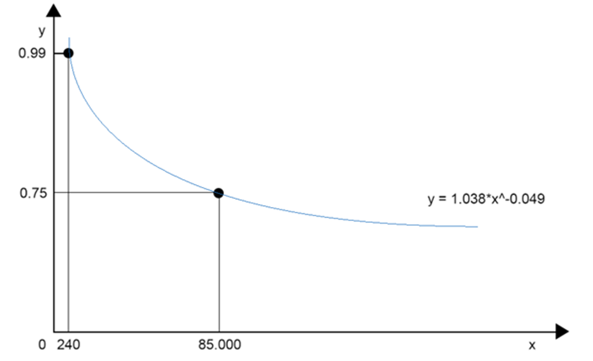
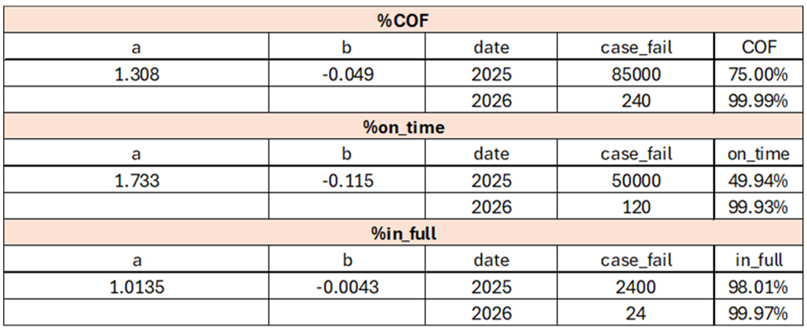
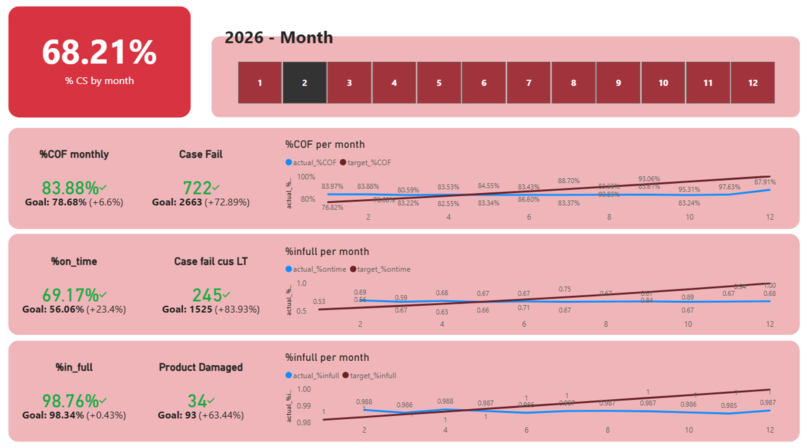
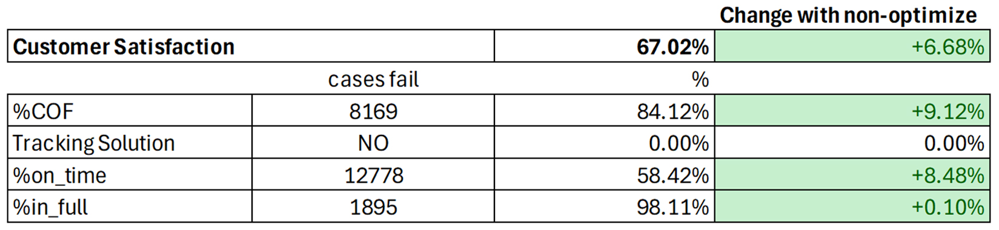

# CUSOMTER SATISFACTION ANALYTICS | NESTLÉ VIETNAM

## Project Overview
This project addresses a critical supply chain challenge for Market A, where Customer Satisfaction had plummeted to **60%**  
The goal was to analyze root causes, model historical performance, and develop a data-driven strategy to improve service levels and become the **"partner of choice"**  
The project employs a full stack analytics include Descriptive, Predictive, and Prescriptive to optimize 3PLs (Third-Party Logistics) performance and streamline outbound/inbound operations

## Explanation
The business faced several operational bottlenecks in 2025, that caused low Customer Satisfaction percentage:
1. Low Customer Order Fulfillment (COF): Internal KPI was only 75% due to truck/vessel delays (50k cases), packaging delays (20k cases), and production interruptions (15k cases)
2. Lack of Visibility: No order tracking solution was in place, forcing customers to manually call service teams
3. Late Deliveries: 50% of shipments failed to meet customer lead times
4. Product Damage: The bad goods ratio spiked to 2% (vs. 0.2% the previous year)

## Problem Statement
- What are problems that related with %Customer Satisfaction? How many cases of each criteria?
- Can you set the KPIs for each criteria to improve %Customer Satisfacion in the last 2026? My boss approve for 240 cases fail COF, 120 cases fail customer lead time, 24 product damaged cases yearly.
- What is the main cause? If we can reduce the impact of this cause, how many %Customer Satisfaction be improved?

## Data Architecture
The analysis was built on 8 integrated datasets processed via Power Query and Power BI:
- supplier_inf: 100 suppliers' reliability data.
- material_inf: 19 raw and packaging materials.
- 3PL_inf: Performance data for 9 logistics partners.
- manufacture_sp: 90k records of inbound stock flow.
- purchase_order: 60k records of supplier orders.
- production: 35k production records across 3 plants.
- shipment: 120k records of outbound deliveries to retailers.
- tracking: Status of the tracking solution  

## Methodology
**1. Descriptive**  
After discuss with teamate, we decided Customer Satisfaction Index was established using a weighted formula:  
  **%CS = 0.62⋅COF + 0.18⋅Tracking + 0.12⋅OnTime + 0.08⋅InFull**
where:

Then we created the dashboard, it can use for descriptive and also check details in next year dataset.

**Insight:** Initial 2025 baseline %CS was confirmed at **61.75%**

**2. Predictive Analytics**  
Used a Power Model (y=a⋅x^b) to project 2026 targets 

**Strategy:** Transformed yearly models into monthly KPI targets to ensure a gradual climb toward 99% fulfillment by late 2026  
**Scenario:** Simulated the impact of introducing an ERP/Tracking solution in August 2026

After that, we created predictive dashboard for tracking each KPI monthly. To track monthly, we need transform Power Model yearly to monthly by mutiple function with 12^b.

**3. Prescriptive**  
Developed an Optimization Solver Model to redistribute shipment volumes across the 9 3PLs based on their historical performance  
**Constraints:**
- Pareto Theory (80% volume to top 3 partners)
- MOQ (Minimum Order Quantity) of 30 shipments/month per 3PL to maintain logistics cost-efficiency

**Objective:** Minimize the total number of failed cases (Late & Damaged). Because of Power Model properties, when the number of cases fail decrese, the results improve.

## Key Results
Immediate Improvement: By simply optimizing 3PL distribution, %Customer Satisfaction improved from 60.33% to 67.02% **(+6.68%)**

**Failure Reduction:**
- Trucking Late cases decreased by 74.45%
- Product Damage decreased by 21.25%
- Global Late cases decreased by 45.61%

**Long-term Goal:** With the integration of the Tracking Solution in August 2026, the model projects %CS reaching **85.81%**

## Tools
- Data Processing: Power Query
- Visualization: Power BI (DAX)
- Optimization: Excel (Solver)
